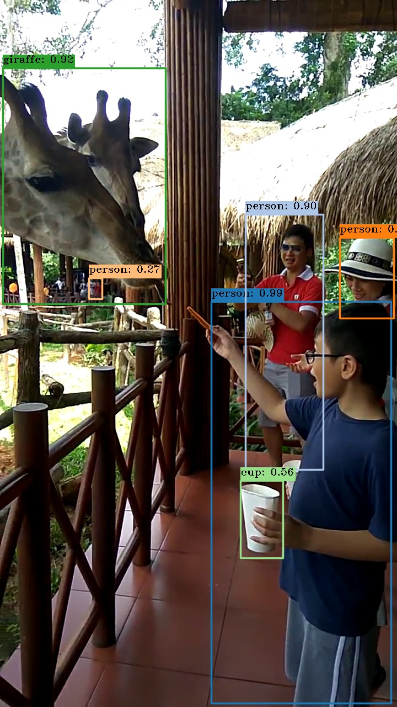

# yolov3-pytorch
Implementation of YOLOv3 in PyTorch, to improve my sloppy understandings about the architecture. 

Followed [this series](https://blog.paperspace.com/how-to-implement-a-yolo-object-detector-in-pytorch/), with some minor changes.

## Usage
`python detect.py img_path cfg_path weights_path`

